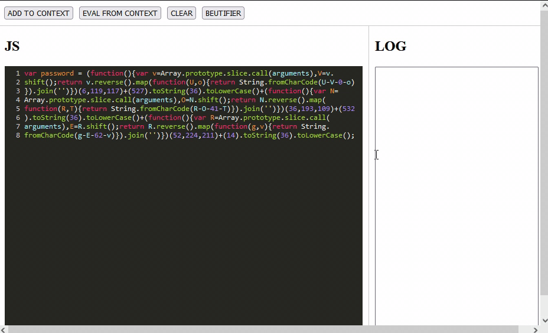

# Online javascript strings deobfuscator
### How to use: [WIKI](https://github.com/mb0rodin/manual-javascript-strings-deobfuscator/wiki)
### Try it online: https://mb0rodin.github.io/manual-javascript-strings-deobfuscator/

# Safety

## Not so bad but still not safe. 

# TODO
- [X] beautifier
- [X] Make it safe
- [ ] Make it more safety
- [ ] Make functions list
- [ ] Make authimatic funtions finder
- [ ] ....

# Credits
 - codemirror - [codemirror5](https://github.com/codemirror/codemirror5)
 - atakde - [online-code-editor](https://github.com/atakde/online-code-editor)
 - beautifier - [js-beautify](https://github.com/beautify-web/js-beautify)
