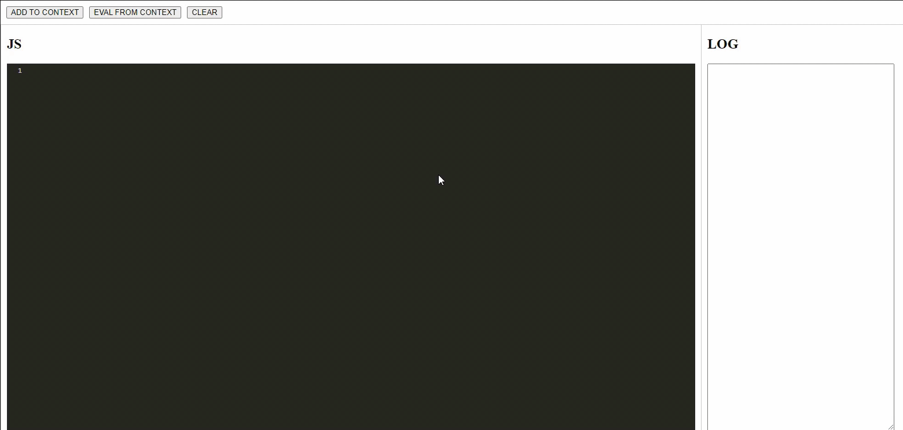
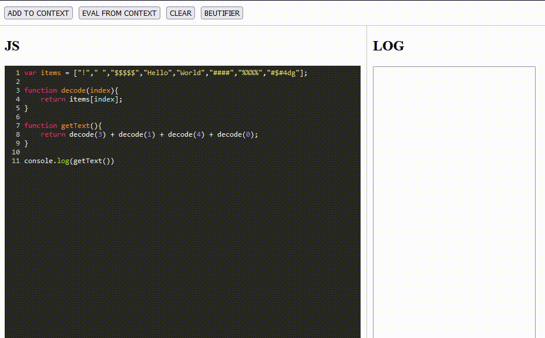
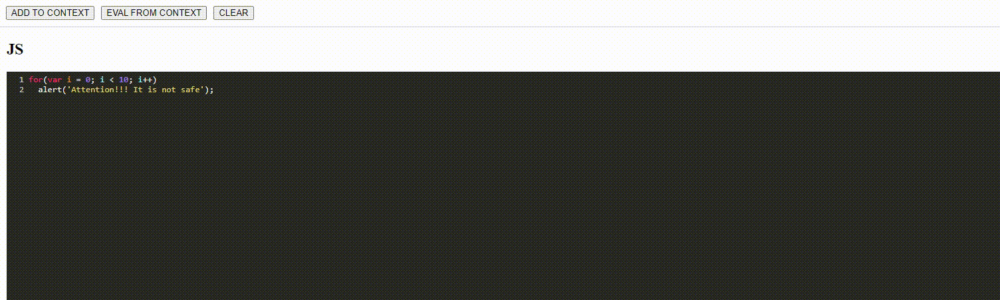

# The simple way to use
Replacing the code with the result of its execution


# The complicated way to use
Add a decoder to the context and execute it for decoding strings.
### Sample:
```javascript
var items = ["!"," ","$$$$$","Hello","World","####","%%%%","#$#4dg"];

function decode(index){
    return items[index];
}

function getText(){
    return decode(3) + decode(1) + decode(4) + decode(0);
}

console.log(getText())
```
In this case, you can add to the context all code before console.log

### Like this:


Or you can add to context just decoder

### Like this:


### Example of use:
